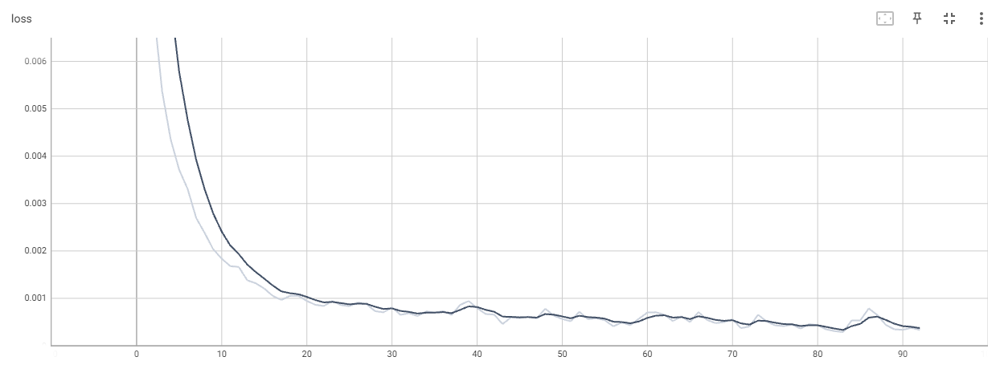

训练经92轮
```
第83轮次的损失是0.0002877321094274521
第84轮次的损失是0.000535129860509187
第85轮次的损失是0.0005347738042473793
第86轮次的损失是0.0007861656486056745
第87轮次的损失是0.0006486883503384888
第88轮次的损失是0.00043897805153392255
第89轮次的损失是0.0003458634309936315
第90轮次的损失是0.0003358407993800938
第91轮次的损失是0.00037669992889277637
第92轮次的损失是0.0003331157786305994
Process finished with exit code 0
```



测试集评分大于0.98

```
==============测试开始==============
第0轮的得分是0.983203113079071
第1轮的得分是0.983203113079071
第2轮的得分是0.983203113079071
第3轮的得分是0.981738269329071
第4轮的得分是0.983203113079071
第5轮的得分是0.981738269329071
第6轮的得分是0.983203113079071
第7轮的得分是0.983203113079071
```